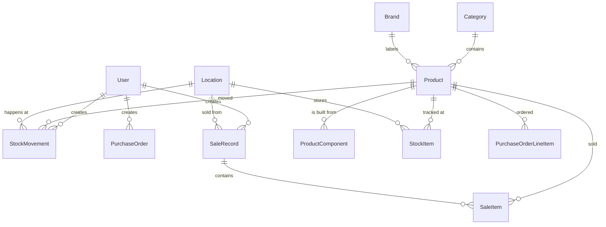

# Database Schema Reference
# Aqua Classic Water Filters — Inventory Management System

## Primary Table Models

### `catalog_product`
- `name`: CharField(200)
- `sku`: CharField(60, unique)
- `category_id`: ForeignKey(Category)
- `brand_id`: ForeignKey(Brand, nullable)
- `pieces_per_box`: PositiveIntegerField(nullable)
- `cost_price`: DecimalField(12, 2)
- `stage_count`: PositiveIntegerField(nullable)
- `unit_type`: CharField (`COMPONENT`, `FINISHED_UNIT`)
- `is_active`: BooleanField(default=True)

### `inventory_stockmovement`
- `product_id`: ForeignKey(Product)
- `location_id`: ForeignKey(Location)
- `movement_type`: CharField (`PURCHASE_IN`, `SALE_OUT`, `ADJUSTMENT_OUT`, `ASSEMBLY_OUT`)
- `quantity`: DecimalField(12, 3)
- `unit_cost`: DecimalField(12, 2)
- `reference_note`: CharField(255)
- `created_by_id`: ForeignKey(User)
- `created_at`: DateTimeField(auto_now_add=True)

### `sales_salerecord` & `sales_saleitem`
- `customer_name`: CharField(160) - "Walk-in Customer" or "Salesman"
- `total_amount`: DecimalField(12, 2)
- `SaleItem.quantity`: DecimalField(12, 3)
- `SaleItem.sale_price`: DecimalField(12, 2)
